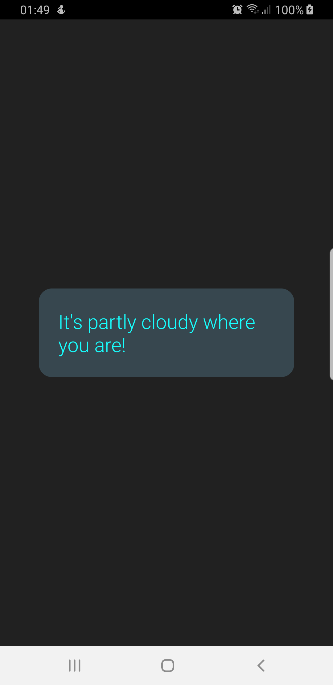

# KLARNA ANDROID CODING CHALLANGE

   
  
   

As there was no emphasize on design, I just displayed the weather summary.

# ARCHITETCURE

I used clean architecture, and it's implemented according to the next two illustrations
   
  
   
  
   

## LIBRARIES

- Location
- RxJava 2
- Retrofit (OkHttp included)
- Moshi
- PermissionDispatcher

